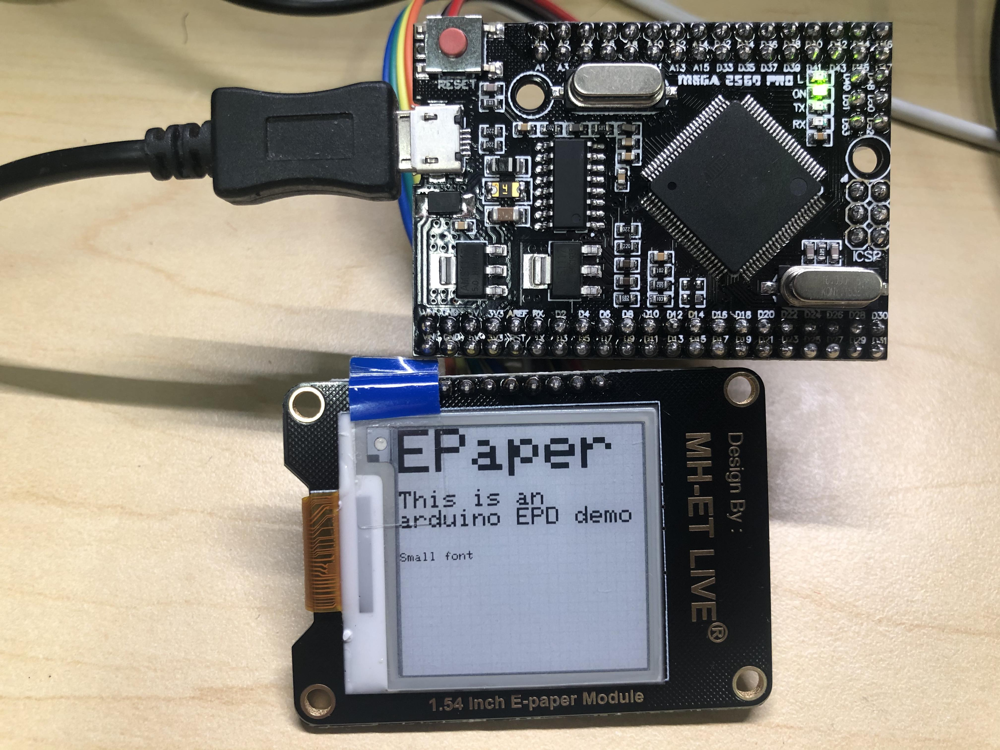

# Arduino E-paper Display (EPD) Demo

## Introduction

A demo of Arduino E-paper Display. Using Arduino [Adafruit_EPD library](https://github.com/adafruit/Adafruit_EPD).

## Connection

	    MEGA               EPD (SSD1608)
	+------------+          +-------+
    +        +5V +----------+ VCC   +
    +        GND +----------+ GND   +  
	+ (MOSI) D51 +----------+ SDI   +  
	+ (SCK)  D52 +----------+ SCLK  +
    + (CS)   D53 +----------+ CS    +
    +        D9  +----------+ D/C   +
    +        D5  +----------+ Reset +
    +        D7  +----------+ Busy  +
	+------------+          +-------+

## Usage

Flash the Program to the arduino. After the micro-controller reset, the demo program will execute automatically.

## Implementation

## Reference
https://github.com/adafruit/Adafruit_EPD